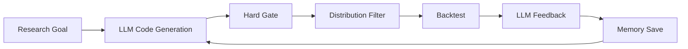
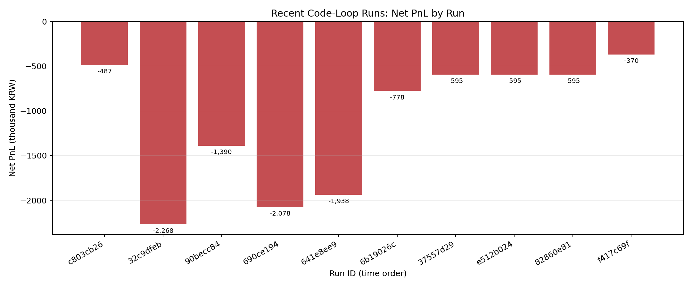

# proj_rl_agent 구현 근황 및 교수님 미팅 정리

작성일: 2026-04-06  
대상: 30분 미팅 / Notion 입력용 정리본  
기준 시점: 2026-04-06 UTC

> 이 문서는 현재 `proj_rl_agent`의 실제 산출물, 로그, 백테스트 결과를 기준으로 작성했다.  
> 로컬 이미지 링크가 포함되어 있다. Notion import 시 이미지가 자동으로 안 따라오면, 각 그림 아래에 적은 PNG 파일을 직접 드래그해서 넣으면 된다.

---

## 0. Executive Summary

| 항목 | 현재 상태 | 근거 |
|---|---|---|
| 최근 실제 실험 중심 | `code_loop` 기반 Python 전략 생성 루프 | `scripts/run_strategy_loop.py`, `outputs/backtests_code/*` |
| 최근 백테스트 산출물 수 | 34 runs | `outputs/backtests_code/` |
| 저장된 전략 메모리 수 | 34 records | `outputs/memory_code/strategies/*.json` |
| 최근 결과 verdict | `fail 32`, `retry 2`, `pass 0` | `outputs/memory_code/strategies/*.json` 집계 |
| 최근 LLM 활동 | `code_generation 63`, `feedback 18` logs | `outputs/llm_logs/` |
| 가장 중요한 해석 | 현재는 "좋은 signal 자체가 약함" + "현실적 execution cost에 쉽게 무너짐"이 동시에 보임 | 대표 run 분석 |
| 교수님 피드백 반영 상태 | realism/monitoring 기반은 구현되어 있으나, code loop 자동 검증 경로는 아직 미완 | `scripts/backtest.py` vs `src/strategy_loop/loop_runner.py` |

---

## 1. 한눈에 보는 현재 구조

### 1.1 현재 실제 주력 경로



### 1.2 구현 축은 2개가 공존함

| 경로 | 현재 역할 | 출력 형식 | 실제 최근 사용도 | 비고 |
|---|---|---|---|---|
| `code_loop` | 현재 주력 | Python code string | 높음 | 최근 실험 대부분이 이 경로 |
| `v2 JSON spec` | 보조/실험적/이전 축 | strategy spec JSON | 중간 | 표현력은 좋지만 downstream 소비는 부분적 |

### 1.2 부연 설명

- 여기서 `v2 JSON spec`이 `code_loop`보다 "표현력이 좋다"고 쓴 의미는, `JSON`이라는 언어가 `Python`보다 강력하다는 뜻이 아니다. 언어 자체의 일반 표현력은 당연히 `Python`이 더 크다.
- 정확한 뜻은, **현재 프로젝트에서 프레임워크가 전략을 읽고 이해하는 방식 기준으로 보면** `v2 JSON spec`이 전략의 도메인 구조를 더 명시적으로 적을 수 있다는 것이다.
- 현재 `code_loop` 경로는 실질적으로 `UPPER_CASE` 상수 몇 개와 `generate_signal(features, position) -> int | None`만 소비한다. 즉, 전략 의미가 대부분 "언제 진입할지 / 언제 청산할지" 수준으로 압축된다.
- 반면 `v2 JSON spec`은 `preconditions`, `entry_policies`, `exit_policies`, `risk_policy`, `execution_policy`, `regimes`, `metadata`를 분리해서 적을 수 있다. 따라서 전략을 하나의 함수로 뭉개지 않고, 전략 구성요소를 구조적으로 구분해 표현할 수 있다.
- 다만 현재 구현에서는 이 JSON spec의 모든 필드를 downstream이 완전히 소비하지는 않는다. 예를 들어 execution policy는 일부 hint-level만 사용된다.
- 따라서 가장 정확한 표현은 아래와 같다.

| 비교 관점 | `code_loop` | `v2 JSON spec` |
|---|---|---|
| 언어 자체의 일반 표현력 | 높음 (`Python`) | 낮음 (`JSON`) |
| 현재 프로젝트가 구조적으로 읽는 전략 의미 | 좁음 | 더 풍부함 |
| 현재 downstream 소비 범위 | 높음 | 부분적 |

정리하면, **`Python`이 `JSON`보다 약해서가 아니라, 현재 `code_loop` 인터페이스가 좁고 `v2 JSON spec`이 전략 구조를 더 명시적으로 드러낼 수 있기 때문에** 이렇게 구분했다.

### 1.3 코드 기준 구조 요약

| 블록 | 상태 | 핵심 파일 |
|---|---|---|
| 전략 생성 루프 | 구현됨 | `src/strategy_loop/loop_runner.py` |
| 코드 하드게이트 | 구현됨 | `src/strategy_loop/hard_gate.py` |
| 사전 분포 필터 | 구현됨 | `src/strategy_loop/distribution_filter.py` |
| 백테스트 러너 | 구현됨 | `src/evaluation_orchestration/layer7_validation/pipeline_runner.py` |
| realism diagnostics 저장 | 구현됨 | `summary.json`, `realism_diagnostics.json` |
| monitoring/verifier/export | 구현됨 | `src/monitoring/*` |
| monitoring의 code loop 자동 연결 | 미완 | code loop 내부는 plain `PipelineRunner` 사용 |
| canonical backtest context helper | 구현됨 | `src/utils/config.py` |
| 해당 context의 generation/review 실제 주입 | 아직 확인 안 됨 | 테스트만 존재 |

---

## 2. 교수님 피드백 기준으로 본 현재 상태

## 2.1 "기존 LLM이 왜 전략 생성을 잘 못하는가"

| 원인 | 현재 코드/실험 근거 | 해석 |
|---|---|---|
| 탐색 공간이 좁음 | archetype 1~4 중심 prompt, `generate_signal(features, position)` 단일 함수 구조 | 실제로는 "새 전략 발명"보다 "threshold 조정"에 가까워짐 |
| 경제성 제약을 내재화하기 어려움 | 수수료, 슬리피지, latency, queue friction이 모두 존재 | 약한 alpha는 현실적 cost에 바로 상쇄됨 |
| 실패 후 반복 수렴 | 동일하거나 유사한 성과가 연속 발생 | 구조 전환보다 근처 상수만 재탐색하는 경향 |
| 실제 결과가 구조적 실패 위주 | `fail 32`, `retry 2`, `pass 0` | signal 자체가 cost 전에도 약한 사례가 다수 |
| 일부는 fee-dominated | `retry` run에서 gross 여지는 있으나 cost가 더 큼 | "신호는 조금 맞지만 execution friction이 더 크다"는 뜻 |
| feedback stack 버전 드리프트 | 현재 소스는 controller 기반, 일부 실험 로그는 legacy feedback schema 흔적 존재 | 구현은 진화 중이지만 실험/로그는 완전히 동기화되지 않음 |

### 2.2 "Backtest가 정말 정합적인가, 눈으로 확인/계산/모니터링 가능한가"

| 항목 | 구현 상태 | code loop 자동 반영 여부 | 메모 |
|---|---|---|---|
| `summary.json` 저장 | 예 | 예 | 핵심 수치 확인 가능 |
| `realism_diagnostics.json` 저장 | 예 | 예 | queue/latency/cancel 정보 존재 |
| `signals/orders/fills/pnl_series/quotes` 저장 | 예 | 예 | eye-check 가능 |
| monitoring EventBus | 예 | 아니오 | standalone backtest CLI에는 연결됨 |
| fee/slippage/latency/queue verifier | 예 | 아니오 | code loop 내부엔 아직 미연결 |
| `verification.json` export | 예 | 아니오 | 현재 최근 code loop 산출물에서는 확인되지 않음 |
| canonical backtest constraint context | 예 | 아직 아님 | helper는 구현, prompt 주입은 미확인 |

### 2.3 현재 가장 정확한 메시지

> 백테스트 엔진 자체는 realism 정보를 꽤 많이 저장하고 있으며, 사람이 fill/order/PNL을 눈으로 따라갈 수 있는 수준까지는 와 있다.  
> 하지만 "전략 생성 루프가 자동으로 정합성 검증 리포트까지 남기는 체계"는 아직 완성되지 않았다.

---

## 3. 실제 실험 내역 요약

### 3.1 Artifact 집계

| 구분 | 수량 | 위치 |
|---|---|---|
| code-loop backtests | 34 | `outputs/backtests_code/` |
| memory strategy records | 34 | `outputs/memory_code/strategies/` |
| code generation logs | 63 | `outputs/llm_logs/code_generation_*.json` |
| feedback logs | 18 | `outputs/llm_logs/feedback_*.json` |
| 최근 백테스트 산출 시각 | 2026-04-06 08:29 UTC | run `f417c69f-...` |

### 3.2 Verdict 분포

| verdict | count | 해석 |
|---|---:|---|
| `fail` | 32 | 구조적 실패 또는 명확한 비수익 패턴 |
| `retry` | 2 | core idea는 남아 있으나 cost/threshold 조정 필요 |
| `pass` | 0 | 아직 profitable run 없음 |

### 3.3 최근 code-loop run 성과 추이



그림 파일: `docs/assets/meeting_20260406/recent_code_loop_net_pnl.png`

해석:
- 최근 10개 run 모두 여전히 음수다.
- 다만 최신 run은 `-370k KRW` 수준까지 손실이 줄어든 흔적이 있다.
- 즉, 완전히 random search는 아니고 일부 개선 방향은 보이나, 아직 profitable zone에 도달하지 못했다.

### 3.4 최근 10개 run 요약

> 이 표는 `순이익(net_pnl)` 기준으로만 압축해서 본 것이다.  
> 각 run의 코멘트는 최근 탐색 흐름을 파악하기 위해 그대로 유지한다.

| run_id | net_pnl (KRW) | 관찰 |
|---|---:|---|
| `c803cb26` | -487,101 | 손실 규모 비교적 작음 |
| `32c9dfeb` | -2,267,781 | 구조적 실패 |
| `90becc84` | -1,389,942 | 손실 큼 |
| `690ce194` | -2,077,729 | 손실 큼 |
| `641e8ee9` | -1,938,473 | 손실 큼 |
| `6b19026c` | -777,870 | 개선되지만 음수 |
| `37557d29` | -594,731 | fee-dominated 계열 |
| `e512b024` | -594,731 | 동일 계열 반복 |
| `82860e81` | -594,731 | 동일 계열 반복 |
| `f417c69f` | -369,658 | 최근 기준 가장 개선된 축 |

---

## 4. 대표 실험 예시

> 이 섹션은 가독성을 위해 대표 성과 지표만 남긴다.  
> `commission`, `slippage`, `child_order_count` 같은 비용/체결 구조 지표는 뒤의 `7.2 cost-dominated failure`와 `8. Backtest 정합성`에서 별도로 해석한다.

## 4.1 Example A: 가장 덜 나쁜 run

대상 run: `a3ecc09a-a391-41b7-ab3a-ad24aa4d06c1`

| 지표 | 값 |
|---|---:|
| `net_pnl` | -120,082 KRW |
| `max_drawdown` | 0.999995 |
| `sharpe_ratio` | -3.486 |

핵심 해석:
- 세 지표 모두 보수적으로 봐도 좋지 않다. 손실은 작지만 여전히 음수이고, Sharpe도 분명히 음수다.
- 즉, "거래 수를 줄이면 해결된다" 수준이 아니라, 신호 자체의 기대값이 충분히 강하지 않다는 사례로 보기 좋다.


그림 파일: `outputs/backtests_code/a3ecc09a-a391-41b7-ab3a-ad24aa4d06c1/plots/dashboard.png`

관찰 포인트:
- 손실 규모는 상대적으로 작지만 Sharpe가 여전히 음수다.
- 즉, 덜 나쁜 run이지 좋은 run은 아니다.

---

## 4.2 Example B: 큰 손실의 전형적 사례

대상 run: `9a47914b-edc1-4968-a153-0e6340f2a6eb`

| 지표 | 값 |
|---|---:|
| `net_pnl` | -5,169,615 KRW |
| `max_drawdown` | 0.9999998 |
| `sharpe_ratio` | -13.200 |

핵심 해석:
- 대표적인 실패 사례다. 순손익이 매우 크고, MDD는 사실상 1에 가깝고, Sharpe도 크게 음수다.
- 즉, 특정 구간에서 잠깐 미끄러진 전략이 아니라 하루 전체를 통틀어 일관되게 좋지 않았던 run으로 해석하는 게 맞다.


그림 파일: `outputs/backtests_code/9a47914b-edc1-4968-a153-0e6340f2a6eb/plots/intraday_cumulative_profit.png`

관찰 포인트:
- 장중 cumulative profit이 거의 계속 하락한다.
- 특정 구간 반등이 아니라 구조적으로 우하향한다.
- 하루 전체에서 일관되게 좋지 않은 전략이었다는 점이 시각적으로도 명확하다.

---

## 4.3 Example C: 최신 run

대상 run: `f417c69f-8d5a-49c7-b002-eaeb3dc4efb4`

| 지표 | 값 |
|---|---:|
| `net_pnl` | -369,658 KRW |
| `max_drawdown` | 0.9999975 |
| `sharpe_ratio` | -6.239 |

핵심 해석:
- 최근 실험 중에서는 손실 규모가 줄어든 편이지만, 순이익은 여전히 음수이고 Sharpe도 개선되지 않았다.
- 즉, 최근 방향은 "덜 나빠지는 중"으로 볼 수는 있어도, 아직 전략이 안정적으로 유의미한 성과를 낸다고 보기는 어렵다.


그림 파일: `outputs/backtests_code/f417c69f-8d5a-49c7-b002-eaeb3dc4efb4/plots/trade_timeline.png`

관찰 포인트:
- 실제 체결 위치와 signal 전환 타이밍을 눈으로 추적 가능하다.
- 따라서 "백테스트가 완전히 블랙박스"는 아니다.
- 다만 이 정보를 code loop 자동 선별 기준으로 아직 활용하지 못하고 있다.

---

## 5. 전략 생성 Agent Framework 현재 수준

## 5.1 실제 주력 출력 형식: Python code

현재 주력 경로의 출력은 아래 형태다.

```python
TRADE_FLOW_IMBALANCE_EMA_THRESHOLD = 0.658767
ORDER_IMBALANCE_DELTA_THRESHOLD = 0.305232
PRICE_IMPACT_BUY_BPS_THRESHOLD = 29.8936
SPREAD_MAX_BPS = 185.158
HOLDING_TICKS_EXIT = 106
REVERSAL_THRESHOLD = -1.34543

def generate_signal(features, position):
    holding = position["holding_ticks"]
    in_pos = position["in_position"]

    if in_pos:
        if holding >= HOLDING_TICKS_EXIT:
            return -1
        if features.get("order_imbalance_delta", 0.0) < REVERSAL_THRESHOLD:
            return -1
        return None

    trade_flow_imbalance_ema = features.get("trade_flow_imbalance_ema", 0.0)
    order_imbalance_delta = features.get("order_imbalance_delta", 0.0)
    spread = features.get("spread_bps", 999.0)
    price_impact_buy_bps = features.get("price_impact_buy_bps", 999.0)

    if (trade_flow_imbalance_ema < TRADE_FLOW_IMBALANCE_EMA_THRESHOLD
            and order_imbalance_delta > ORDER_IMBALANCE_DELTA_THRESHOLD
            and spread < SPREAD_MAX_BPS
            and price_impact_buy_bps < PRICE_IMPACT_BUY_BPS_THRESHOLD):
        return 1

    return None
```

출처: `outputs/memory_code/strategies/cb9cd5f1.json`

### 5.2 저장 포맷

| 필드 | 의미 |
|---|---|
| `run_id` | 실험 식별자 |
| `strategy_name` | 루프 iteration 이름 |
| `code` | 실제 생성된 Python 전략 코드 |
| `backtest_summary` | run 요약 지표 |
| `feedback` | LLM 혹은 controller 기반 피드백 |

즉, 현재는 "전략 = 코드"로 취급하는 경로가 실제 주력이다.

---

## 6. v2 JSON spec 경로는 어디까지 왔는가

예시 파일: `strategies/openai_imbalance_momentum_plan_v2.0.json`

### 6.1 표현 가능한 내용

| 레이어 | 표현 가능 여부 | 예시 |
|---|---|---|
| preconditions | 가능 | `spread_ok` |
| entry policies | 가능 | `long_entry`, `short_entry` |
| exit policies | 가능 | `stop_loss`, `time_exit`, `spread_exit` |
| risk policy | 가능 | `max_position`, `inventory_cap` |
| execution policy | 부분 가능 | `placement_mode`, `cancel_after_ticks`, `max_reprices` |

### 6.2 하지만 실제 소비는 부분적임

| 항목 | 상태 | 해석 |
|---|---|---|
| JSON spec 자체 | 존재 | 생성/저장 가능 |
| static review artifact | 존재 | review 흔적 있음 |
| universe backtest 결과 | 존재 | 종목별 결과 파일 존재 |
| execution policy full downstream consumption | 미완 | 일부 hint-level만 소비 |
| 현재 주력 경로 | 아님 | 최근 실험은 code loop 중심 |

### 6.3 실제 산출물 비교: code output vs JSON spec output

이 섹션은 "두 경로가 실제로 어떤 결과물을 남기는가"를 직관적으로 비교하기 위한 것이다.  
즉, 성능 비교라기보다 `전략을 어떤 형태로 표현하고 저장하는가`를 보여주는 섹션이다.

| 비교 항목 | code loop 산출물 | v2 JSON spec 산출물 |
|---|---|---|
| 대표 파일 | `outputs/memory_code/strategies/cb9cd5f1.json` | `strategies/openai_imbalance_momentum_plan_v2.0.json` |
| 핵심 payload | `code` 문자열 | `preconditions`, `entry_policies`, `exit_policies`, `risk_policy`, `execution_policy` |
| 직접 표현되는 의미 | 진입/청산 로직과 threshold | 전략 구성요소의 역할 분리 |
| downstream 연결성 | 높음 | 부분적 |
| 최근 실험 사용도 | 높음 | 낮음 |
| 읽는 방식 | 실행 가능한 함수 | 선언적 전략 명세 |

#### Code loop 산출물 예시

> 아래 예시는 가독성을 위해 설명용 주석을 추가한 Python 형태다.  
> 실제 memory record 안에는 comment 없는 code string으로 저장된다.

```python
TRADE_FLOW_IMBALANCE_EMA_THRESHOLD = 0.658767  # trade flow imbalance EMA 진입 기준치
ORDER_IMBALANCE_DELTA_THRESHOLD = 0.305232  # order imbalance delta 진입 기준치
PRICE_IMPACT_BUY_BPS_THRESHOLD = 29.8936  # 매수 예상 price impact 허용 상한
SPREAD_MAX_BPS = 185.158  # 진입 가능한 최대 spread
HOLDING_TICKS_EXIT = 106  # 최대 보유 tick 수
REVERSAL_THRESHOLD = -1.34543  # 반전 신호로 간주할 order imbalance delta 기준

def generate_signal(features, position):
    if position["in_position"]:  # 이미 포지션이 있으면 청산 조건부터 검사
        if position["holding_ticks"] >= HOLDING_TICKS_EXIT:
            return -1  # 시간 기반 청산
        if features.get("order_imbalance_delta", 0.0) < REVERSAL_THRESHOLD:
            return -1  # 반대 방향 신호가 강해지면 청산
        return None  # 계속 보유

    if (features.get("trade_flow_imbalance_ema", 0.0) < TRADE_FLOW_IMBALANCE_EMA_THRESHOLD
            and features.get("order_imbalance_delta", 0.0) > ORDER_IMBALANCE_DELTA_THRESHOLD
            and features.get("spread_bps", 999.0) < SPREAD_MAX_BPS
            and features.get("price_impact_buy_bps", 999.0) < PRICE_IMPACT_BUY_BPS_THRESHOLD):
        return 1  # 모든 조건을 만족하면 진입

    return None  # 진입 조건이 아니면 관망
```

출처: `outputs/memory_code/strategies/cb9cd5f1.json`

#### JSON spec 산출물 예시

> 아래 예시는 가독성을 위해 설명용 주석을 추가한 `jsonc` 형태다.  
> 실제 원본 파일은 comment가 없는 순수 JSON이다.

```jsonc
{
  "preconditions": [ // 진입 전에 반드시 만족해야 하는 시장 상태
    {
      "name": "spread_ok", // 전제조건 이름
      "condition": {"type": "comparison", "op": "<", "threshold": 30.0, "feature": "spread_bps"} // spread가 너무 넓지 않은지 검사
    }
  ],
  "entry_policies": [ // 실제 진입 로직 정의
    {
      "name": "long_entry", // 롱 진입 규칙 이름
      "side": "long", // 어느 방향 포지션인지
      "trigger": { // 진입 판단식
        "type": "all", // 아래 조건을 모두 만족해야 함
        "children": [
          {"type": "comparison", "op": ">", "threshold": 0.3, "feature": "order_imbalance"}, // 주문 불균형 조건
          {"type": "comparison", "op": ">", "threshold": 0.1, "feature": "depth_imbalance"} // 호가 깊이 불균형 조건
        ]
      }
    }
  ],
  "exit_policies": [ // 보유 중 포지션을 청산하는 규칙
    {
      "name": "risk_exits", // 리스크 기반 청산 묶음
      "rules": [
        {"name": "stop_loss", "action": {"type": "close_all"}}, // 손절 발생 시 전체 청산
        {"name": "time_exit", "action": {"type": "close_all"}} // 일정 시간 경과 시 전체 청산
      ]
    }
  ],
  "risk_policy": {"max_position": 400, "inventory_cap": 800}, // 포지션/인벤토리 한도
  "execution_policy": {"placement_mode": "passive_join", "cancel_after_ticks": 15, "max_reprices": 2} // 주문 제출/취소/재호가 방식
}
```

출처: `strategies/openai_imbalance_momentum_plan_v2.0.json`

### 6.4 이 비교에서 보이는 차이

| 관점 | code loop | v2 JSON spec | 해석 |
|---|---|---|---|
| 강점 | 바로 실행 가능 | 전략 구조를 명시적으로 표현 가능 | code loop는 실험 속도, JSON spec은 설명 가능성이 강함 |
| 약점 | 전략 의미가 함수 하나에 압축됨 | 실행 경로가 아직 부분 연결 | JSON spec은 예쁘게 표현돼도 실제 소비가 덜 된다 |
| 교수님 설명 포인트 | "현재 실제 실험은 이 경로" | "전략 구조를 정리해서 보여주기엔 이 경로가 유리" | 두 축이 공존하는 이유를 설명하기 좋음 |

핵심 해석:
- `code loop`는 현재 실험 주력 경로이기 때문에, 실제 성능 논의는 이 경로 기준으로 설명하는 것이 맞다.
- `v2 JSON spec`은 전략을 더 구조적으로 설명하기 좋지만, 현재는 실행/평가 파이프라인 연결이 부분적이다.
- 따라서 미팅에서는 `실험의 중심은 code loop`, `전략 구조 설명은 JSON spec이 더 직관적`이라고 분리해서 말하는 편이 가장 정확하다.

---

## 7. 왜 LLM 전략 생성이 현재 잘 안 되는지, 실험 기반으로 정리

이 섹션의 핵심은 단순하다.  
현재 LLM은 "형식상 전략을 만들어내는 것" 자체는 잘하지만, `현실적 비용을 감안해도 살아남는 전략`을 안정적으로 찾는 단계까지는 아직 못 갔다.

최근 산출물을 기준으로 보면 실패 원인은 크게 세 층위로 나뉜다.
1. signal edge 자체가 약한 구조적 실패
2. signal이 조금 있더라도 execution cost에 무너지는 비용 지배 실패
3. feedback/monitoring/constraint injection이 아직 완전히 닫히지 않은 실험 루프의 미성숙

### 7.1 구조적 실패

| 현상 | 실제 evidence | 의미 |
|---|---|---|
| gross 이전부터 약함 | `fail 32 / retry 2 / pass 0` | threshold만 조절해서 해결되기 어려움 |
| 동일 계열 반복 | `-594,731 KRW` 계열 run 반복 | logic 다양화가 충분하지 않음 |
| long holding인데도 손실 | latest run `avg_holding_period=1601.2` | 단순 holding 부족 문제로 보기 어려움 |

설명:
- `fail 32 / retry 2 / pass 0`는 단순히 cost가 많이 들어서 망했다는 뜻만은 아니다. 상당수 run은 애초에 gross 기준에서도 edge가 약하다는 신호로 읽는 것이 맞다.
- 특히 `-594,731 KRW` 계열 run이 반복된 것은, LLM이 완전히 새로운 전략 구조를 탐색하기보다 비슷한 로직 주변에서 threshold만 다시 만지는 경향이 강하다는 뜻이다.
- 최신 run에서 holding period를 크게 늘려도 여전히 손실이라는 점은, 문제를 단순히 "너무 짧게 들고 빨리 청산해서"로 설명하기 어렵게 만든다. 즉, 신호의 방향성 자체가 충분히 강하지 않을 가능성이 높다.

### 7.2 cost-dominated failure

| 현상 | 실제 evidence | 의미 |
|---|---|---|
| 수수료 비중 큼 | 대표 run에서 `commission` 수십만~수백만 KRW | 단순 방향 예측보다 execution quality가 더 중요 |
| 슬리피지 누적 큼 | heavy-loss run `slippage 3.67M KRW` | fill 많이 되는 것이 좋은 전략을 뜻하지 않음 |
| child order churn 큼 | heavy-loss run `child_order_count=8196` | cancel/repost 비용 구조가 큼 |

설명:
- 일부 run은 신호가 완전히 무의미하다기보다, gross에서 조금 벌 수 있는 여지가 있더라도 commission과 slippage를 넘지 못하는 형태로 보인다.
- 특히 큰 손실 사례에서는 fill이 잘 된다는 사실이 장점이 아니라, 오히려 churn이 크고 child order가 많이 발생해 비용이 누적된다는 신호가 된다.
- 이 말은 결국 "시장 방향을 맞추는 것"만으로는 부족하다는 뜻이다. 현재 환경에서는 `언제 진입하느냐` 못지않게 `어떻게 체결되느냐`가 전략 성패를 좌우한다.

### 7.3 prompt/feedback/실험 버전 드리프트

| 항목 | 현재 코드 | 실제 최근 로그 |
|---|---|---|
| feedback ownership | Python controller 중심으로 개선 중 | 일부 log는 legacy schema 흔적 |
| backtest constraint context | helper 구현됨 | generation/review flow 주입 흔적 미약 |
| monitoring export | standalone backtest CLI는 가능 | code loop 산출물에는 자동 export 흔적 없음 |

설명:
- 프레임워크 자체는 계속 좋아지고 있지만, 최근 산출물은 그 최신 설계가 100% 반영된 결과라고 보긴 어렵다.
- 다시 말해, 지금의 성능 한계는 순수하게 "LLM이 멍청해서"라기보다, feedback loop와 backtest interpretation이 아직 충분히 닫히지 않은 시스템 문제도 함께 포함한다.
- 그래서 미팅에서는 `현재 코드베이스가 지향하는 구조`와 `실제로 이미 돌아간 실험 결과`를 분리해서 설명해야 과장 없이 정확한 보고가 된다.

정리하면:
- 현재 실패의 1차 원인은 약한 signal edge다.
- 2차 원인은 realistic execution cost다.
- 그리고 이 두 문제를 더 잘 학습하게 만들어 줄 자동 feedback/verification 루프는 아직 완전히 성숙하지 않았다.

---

## 8. Backtest 정합성 관점에서 바로 말할 수 있는 것

### 8.1 이미 확인 가능한 것

| 확인 항목 | 가능한가 | 방식 |
|---|---|---|
| 장중 cumulative PnL 시각 확인 | 가능 | `intraday_cumulative_profit.png` |
| 체결 위치/시점 eye-check | 가능 | `trade_timeline.png` |
| queue/latency/cancel 진단 확인 | 가능 | `realism_diagnostics.json` |
| signal/order/fill raw CSV 추적 | 가능 | `signals.csv`, `orders.csv`, `fills.csv` |

### 8.2 아직 부족한 것

| 부족한 점 | 왜 문제인가 |
|---|---|
| code loop에서 verifier 자동 저장 없음 | 전략 선택 기준에 정합성 결과가 직접 반영되지 않음 |
| fee/slippage/gross decomposition 수동 sanity check 필요 | summary field 해석 오류 가능성 존재 |
| best/worst fill case 자동 추출 부재 | 교수님이 눈으로 보기 좋은 evidence가 아직 부족 |

### 8.3 미팅에서 강조할 포인트

> "백테스트가 숫자만 내놓는 상태는 아니고, 실제로 fill/order/queue/latency를 따라갈 자료는 있다.  
> 다만 그 자료를 전략 생성 루프의 자동 평가 기준으로 통합하는 작업이 아직 남아 있다."

---

## 9. 핵심 문제점 정리

| 문제 | 현재 증거 | 미팅에서의 문장 |
|---|---|---|
| profitable strategy 부재 | pass 0 | "아직 수익 전략 확보 단계는 아니다." |
| signal edge 자체가 약함 | least-bad run도 음수 | "과매매만 줄인다고 해결되는 단계는 아니다." |
| execution cost가 지배적 | heavy-loss run의 commission/slippage 규모 큼 | "현실적 friction이 전략을 쉽게 무너뜨린다." |
| code loop와 monitoring 통합 부족 | standalone CLI엔 있으나 loop엔 없음 | "정합성 검증 자동화가 아직 비어 있다." |
| spec 표현력과 실행 소비 간 gap | execution policy 일부만 downstream 소비 | "표현 가능한 전략과 실제 시뮬레이터가 쓰는 전략 사이에 차이가 있다." |
| 실험 로그와 현재 코드 버전 차이 | legacy/신규 schema 흔적 공존 | "프레임워크 리팩터링 중이라, 산출물 해석 시 버전 구분이 필요하다." |

---

## 10. 바로 다음 액션 제안

1. code loop backtest에 monitoring/verifier 자동 연결
2. `verification.json` 요약을 memory record에 함께 저장
3. gross/net/commission/slippage reconciliation 표를 run마다 자동 생성
4. 대표 fill/order 샘플 5개를 자동 추출해 사람이 eye-check하기 쉽게 저장
5. canonical backtest constraint context를 generation/review prompt에 실제 주입
6. JSON spec path는 "표현력"과 "실행 소비 범위"의 gap을 줄이는 방향으로 정리

---

## 11. 참고 산출물 경로

| 종류 | 경로 |
|---|---|
| 최근 미팅용 Markdown | `docs/meeting_note_20260406.md` |
| 요약 차트 1 | `docs/assets/meeting_20260406/recent_code_loop_net_pnl.png` |
| 대표 plot A | `outputs/backtests_code/a3ecc09a-a391-41b7-ab3a-ad24aa4d06c1/plots/dashboard.png` |
| 대표 plot B | `outputs/backtests_code/9a47914b-edc1-4968-a153-0e6340f2a6eb/plots/intraday_cumulative_profit.png` |
| 대표 plot C | `outputs/backtests_code/f417c69f-8d5a-49c7-b002-eaeb3dc4efb4/plots/trade_timeline.png` |
| 대표 code memory | `outputs/memory_code/strategies/cb9cd5f1.json` |
| 대표 v2 spec | `strategies/openai_imbalance_momentum_plan_v2.0.json` |
