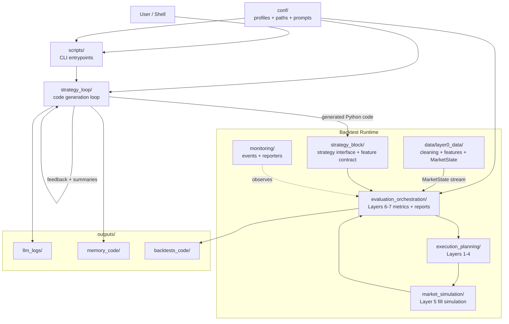
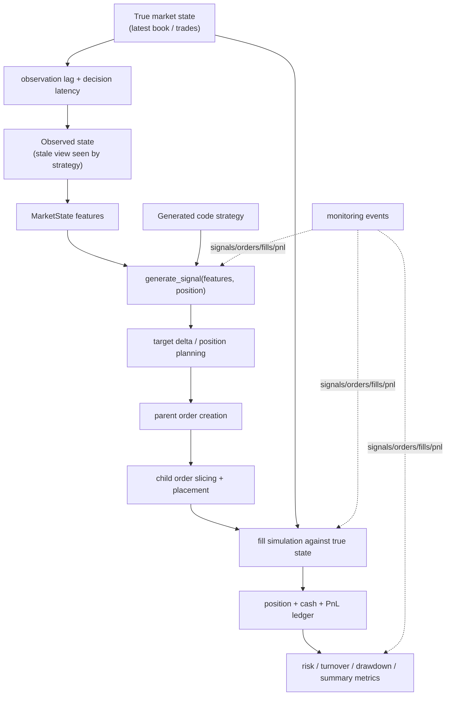
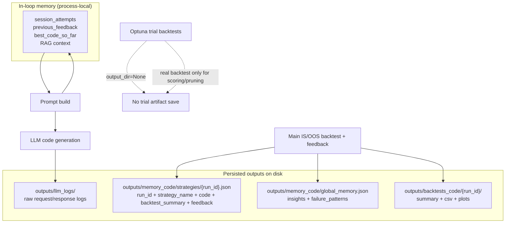

# proj_rl_agent Notion Diagram Set

How to read this: start with the system map, then the single-iteration loop, then the backtest internals, then the artifact and memory writes. These diagrams describe the current code-only runtime, including real-backtest Optuna tuning and no-save trial backtests.



Caption: `strategy_loop` orchestrates code generation and evaluation, but the actual trading realism lives in the `data -> execution_planning -> market_simulation -> evaluation_orchestration` path. `conf/` feeds both the loop and the backtest runtime, while `outputs/` captures logs, memory, and saved final backtests.

```mermaid
sequenceDiagram
    autonumber
    actor User
    participant Shell as run_code_loop_live.sh / run_strategy_loop.py
    participant Loop as LoopRunner
    participant Mem as MemoryStore + session memory
    participant LLM as OpenAIClient
    participant Gate as Hard Gate
    participant Optuna as Optuna tuner
    participant Pipe as PipelineRunner
    participant FB as FeedbackGenerator

    User->>Shell: start code loop
    Shell->>Loop: load config, symbols, IS/OOS
    Loop->>Mem: load insights + failure patterns
    Loop->>LLM: build prompt and generate code
    LLM-->>Loop: Python strategy code
    Loop->>Gate: validate code

    alt hard gate fail
        Gate-->>Loop: reject
        Loop->>Mem: update session memory
        Loop-->>Shell: skip iteration
    else hard gate pass
        Loop->>Optuna: tune UPPER_CASE constants on cached IS states
        loop each Optuna trial
            Optuna->>Pipe: real backtest on 20% / 50% / 100% state prefixes
            Note over Optuna,Pipe: score = net_return_bps - lambda_mdd * mdd_bps\npruning via trial.report()/should_prune()\noutput_dir=None, so trial artifacts are not saved
            Pipe-->>Optuna: score + MDD + entry frequency
        end
        Optuna-->>Loop: optimized code
        Loop->>Loop: distribution filter
        Loop->>Pipe: full IS backtest
        Pipe-->>Loop: backtest summary
        Loop->>FB: generate review prompt
        FB-->>Loop: verdict + suggestions
        Loop->>Mem: save strategy record + global memory

        alt OOS configured and candidate passes
            Loop->>Pipe: OOS backtest
            Pipe-->>Loop: OOS summary
        end

        alt retry
            Loop->>Mem: carry forward session memory
            Loop-->>Shell: next iteration
        else stop / pass
            Loop-->>Shell: loop result
        end
    end
```

Caption: one iteration is `generate -> gate -> tune -> filter -> IS backtest -> feedback -> memory`. The important current behavior is that Optuna now evaluates candidates with real backtests internally, but only the loop's main evaluation backtests are saved to disk.



Caption: the strategy does not trade on the true market state directly. It sees an observed, delayed state; orders are then simulated against the true state, and only after fills are position, PnL, and drawdown metrics updated.



Caption: session memory lives only inside the running loop, while disk persistence is split into LLM logs, per-run strategy records, global cross-run memory, and saved final backtest artifacts. Optuna trial backtests are intentionally excluded from disk output and only exist long enough to score or prune candidate constants.
